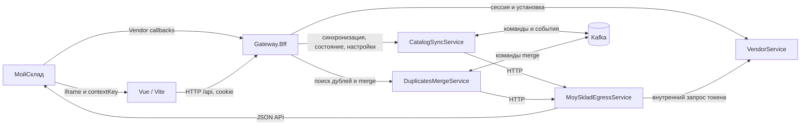

# MS Contractor

**Поиск и объединение дубликатов контрагентов в МойСклад.** Приложение работает во встроенном iframe, синхронизирует каталог контрагентов и переносит связанные документы при объединении.

**Стек:** .NET 10 · Vue 3 / Vite · PostgreSQL · Redis · Kafka · Docker Compose

## Содержание

- [Возможности](#возможности)
- [Быстрый старт](#быстрый-старт)
- [Архитектура](#архитектура)
- [Основные сценарии](#основные-сценарии)
- [Структура репозитория](#структура-репозитория)
- [API и границы доступа](#api-и-границы-доступа)
- [Конфигурация и проверка](#конфигурация-и-проверка)

## Возможности

- Установка приложения в МойСклад, защищённое хранение токена и сессия пользователя для iframe.
- Полная и инкрементальная синхронизация контрагентов с состоянием запусков на обзорной странице.
- Поиск дублей по нормализованным имени, телефону и почте, выбор основного контрагента и итоговых полей.
- Асинхронное объединение: перенос документов, пересоздание отдельных типов и архивирование дубликатов.

## Быстрый старт

Для запуска всего стека нужны Docker с Compose и `make`. Проверьте `.env.dev`: в нём должны быть заданы порты, `INTERNAL_API_KEY`, параметры приложения МойСклад, ключ шифрования токенов и списки типов документов. Не помещайте значения секретов в README или примеры запросов.

```bash
make compose-up
make health
docker compose --env-file .env.dev --profile dev-tools ps
```

| Куда открыть | Адрес |
| --- | --- |
| iframe | `http://localhost:<FRONTEND_IFRAME_PORT>/moysklad/app` |
| Gateway и Swagger UI в режиме Development | `http://localhost:<GATEWAY_BFF_PORT>/swagger` |
| Dozzle, логи контейнеров | `http://localhost:<DOZZLE_PORT>` |

У iframe должна быть действующая сессия: МойСклад передаёт `contextKey` при открытии приложения. Для локальной разработки в `Development` у VendorService есть `POST /api/moysklad/session/dev`; он использует `DEV_ACCOUNT_ID`. Без сессии интерфейс показывает ошибку доступа, даже если контейнеры здоровы.

Остановить стек можно командой `make compose-down`. Команда `make compose-down-del` дополнительно удаляет тома dev-стека, включая данные PostgreSQL и Redis.

## Архитектура



**Gateway.Bff** — точка входа для iframe. Он читает сессию из Redis, определяет аккаунт и пользователя, вызывает внутренние API и проксирует маршруты VendorService. Браузер не получает внутренний API-ключ или токен JSON API МойСклад.

| Компонент | Ответственность | Основные связи |
| --- | --- | --- |
| **VendorService** | Установка приложения, проверка Vendor JWT, зашифрованный токен доступа, iframe-сессия. | Vendor API МойСклад, PostgreSQL (`vendor`), Redis; выдаёт токен Egress по внутреннему запросу. |
| **CatalogSyncService** | Полная/инкрементальная синхронизация, снимок каталога, настройки и состояние запусков. | Получает команды через Kafka, читает МойСклад через Egress, сохраняет данные в PostgreSQL (`catalog_sync`). |
| **DuplicatesMergeService** | Поиск и предпросмотр дублей, очередь задач merge, пошаговый перенос. | Читает каталог в `catalog_sync`, публикует и обрабатывает команды Kafka, вызывает Egress. |
| **MoySkladEgressService** | Единый адаптер к МойСклад JSON API: поиск, изменение и пересоздание документов, изменение и архивирование контрагентов. | Получает токен от VendorService; использует PostgreSQL (`egress`) для снимков и операций, Redis для данных ограничения запросов. |
| **AuditService / NotificationService** | Сейчас содержат health endpoints и фоновые заготовки `Worker`. | Обработка аудита и уведомлений пока не подключена к основным потокам. |

### Данные и обмен сообщениями

| Хранилище | Для чего используется |
| --- | --- |
| **PostgreSQL** | Схемы `vendor`, `catalog_sync`, `egress`: установки и токены, каталог и настройки, задания merge, снимки документов и журналы пересоздания. Merge использует `CatalogSyncDbContext`; миграциями этой схемы владеет CatalogSyncService. |
| **Redis** | Сессии iframe и защита от повторного Vendor JWT; Gateway читает сессии, Egress учитывает лимиты МойСклад. |
| **Kafka** | `mscontractor.commands.sync`, `mscontractor.events.sync`, `mscontractor.commands.merge`. Синхронизация и merge выполняются в фоне после принятия HTTP-запроса. |

Внутренние сообщения и HTTP DTO находятся в `src/Shared/MsContractor.Contracts`. Общие настройки логирования, health endpoints, OpenAPI и проверки внутреннего ключа — в `src/Shared/MsContractor.BuildingBlocks`. Данные ограничены аккаунтом: сервисы передают контекст аккаунта, а слой хранения использует tenant-проверки.

## Основные сценарии

### 1. Установка приложения и вход в iframe

1. МойСклад вызывает Vendor-маршрут установки. VendorService проверяет подпись и данные запроса, сохраняет установку и зашифрованный токен в PostgreSQL.
2. При открытии iframe браузер передаёт `contextKey` в `POST /api/moysklad/session`. VendorService получает контекст через Vendor API, проверяет активную установку и создаёт сессию в Redis.
3. Дальнейшие запросы `/api/*` используют cookie сессии. Gateway определяет аккаунт и пользователя по Redis и передаёт их внутренним сервисам.

### 2. Синхронизация каталога

1. `POST /api/sync` запускает полную синхронизацию, `POST /api/sync/incremental` — инкрементальную. Gateway передаёт запрос в CatalogSyncService; ответ `202` содержит `syncRunId` и статус `queued`.
2. CatalogSyncService публикует `SyncRequested` в Kafka. Его consumer получает команду и через Egress постранично читает контрагентов МойСклад; для архивных контрагентов дополнительно собирает связанные документы.
3. Сервис сохраняет снимок и состояние запуска в PostgreSQL. Для полной загрузки применяется staging; для инкрементальной используется watermark с защитным перекрытием окна. Inbox учитывает уже обработанные сообщения, outbox публикует `SyncCompleted` или `SyncFailed`.
4. `GET /api/catalog/state` отдаёт обзор по текущему аккаунту: последний запуск, число контрагентов, недавние задания merge и состояние подключения к МойСклад.

### 3. Поиск и объединение дублей

1. `POST /api/merge-preview` ищет группы в локальном каталоге; `POST /api/merge-preview/selection` готовит выбранных контрагентов к объединению.
2. `POST /api/merge-jobs` создаёт задачу и операции в PostgreSQL, записывает команду `MergeRequested` в outbox и возвращает `202` с `mergeJobId`. Publisher отправляет команду в Kafka, consumer запускает `MergeProcessor`.
3. Обработчик последовательно обнаруживает документы через Egress, обновляет основного контрагента, меняет контрагента у обычных документов, пересоздаёт `salesreturn`, `purchasereturn`, `facturein` и `factureout`, затем архивирует дубликаты.
4. Прогресс хранится по операциям. При частичном результате подтверждённые изменения сохраняются; незавершённые шаги могут быть повторены. Архивирование начинается после обработки переноса документов.

Egress владеет HTTP-взаимодействием с JSON API и проверкой его ответов. Merge работает с внутренними контрактами Egress. При пересоздании удаление старого документа и создание нового не образуют одну транзакцию в МойСклад; Egress хранит данные операции для восстановления и повторов.

## Структура репозитория

```text
.
├── src/
│   ├── frontend-Iframe/          # Vue-приложение, маршруты, страницы и API-клиент
│   ├── Services/                # семь .NET-сервисов
│   │   ├── Gateway.Bff/
│   │   ├── VendorService/
│   │   ├── CatalogSyncService/
│   │   ├── DuplicatesMergeService/
│   │   ├── MoySkladEgressService/
│   │   ├── AuditService/
│   │   └── NotificationService/
│   └── Shared/                  # межсервисные контракты и общая инфраструктура
├── tests/                       # xUnit-тесты backend
├── docker/                      # Dockerfile для .NET-сервисов
├── scripts/                     # проверки и вспомогательные инструменты
├── scripts_for_test_data/       # генерация и удаление тестовых данных МойСклад
├── script_for_check_merge/      # отдельный инструмент сверки документов до/после merge
├── audit/                       # заметки по аудиту проекта
├── docker-compose.yml
├── Makefile
└── MsContractor.sln
```

Внутри сервисов `Controllers` принимают HTTP-запросы, `Services` содержат сценарии и бизнес-правила, `Repositories` работают с хранилищем, `Persistence` содержит EF Core и миграции. `Clients` вызывают другие сервисы; `Gateways` в Egress обращаются к МойСклад. Фоновые Kafka-обработчики находятся в `Consumers`, публикация событий — в `Messaging`.

Во frontend код лежит в `src/frontend-Iframe/src`: `router` задаёт адреса, `views` — страницы, `components` — элементы интерфейса, `api` — запросы к Gateway. В основной навигации сейчас доступны обзор, дубликаты и настройки; маршруты merge, синхронизации и истории сохранены для прямого перехода.

Дополнительные инструкции: [генератор тестовых данных](scripts_for_test_data/README.md), [сверка merge](script_for_check_merge/README.md) и [генератор связей документов](scripts/moysklad-document-relations-generator/README.md).

## API и границы доступа

| Внешний маршрут через Gateway | Назначение |
| --- | --- |
| `PUT/DELETE /api/moysklad/vendor/1.0/apps/{appId}/{accountId}` | Callback установки или отключения приложения от МойСклад. |
| `POST /api/moysklad/session`, `GET /api/moysklad/session/me` | Создать или проверить iframe-сессию. |
| `POST /api/sync`, `POST /api/sync/incremental` | Поставить синхронизацию в очередь. |
| `GET /api/catalog/state`, `GET /api/catalog/settings`, `PUT /api/catalog/settings` | Прочитать состояние и изменить настройки каталога. |
| `POST /api/merge-preview`, `POST /api/merge-preview/selection` | Найти дубли и получить предпросмотр выбора. |
| `POST /api/merge-jobs` | Создать асинхронное задание объединения. |

Внутренние маршруты `/internal/...` предназначены для сервисов:

| Вызов | Основные маршруты |
| --- | --- |
| Gateway → CatalogSync | `POST /internal/sync`, `GET /internal/accounts/{accountId}/state`, `GET /internal/accounts/{accountId}/settings`, `PUT /internal/accounts/{accountId}/settings` |
| Gateway → Merge | `POST /internal/merge-preview`, `POST /internal/merge-preview/selection`, `POST /internal/merge-jobs` |
| CatalogSync / Merge → Egress | `GET /internal/accounts/{accountId}/counterparties`, `POST /internal/accounts/{accountId}/documents/discover`; изменение и пересоздание документов — через маршруты той же группы `/internal/accounts/{accountId}/documents/...` |
| Egress → Vendor | `GET /internal/vendor/installations/{accountId}/token` |

Эти API проверяют `X-Internal-Api-Key` и контекст аккаунта; для merge-запросов передаются идентификаторы задания, операции и пользователя. Вызовы МойСклад JSON API проходят через Egress, а проверка `contextKey` — через VendorService. Конкретные тела запросов и ответы можно посмотреть в OpenAPI каждого сервиса через Swagger UI Gateway в режиме Development и в [HTTP-примерах Egress](src/Services/MoySkladEgressService/Testhttp/).

## Конфигурация и проверка

| Группа `.env.dev` | Назначение |
| --- | --- |
| `INTERNAL_API_KEY`, `MOYSKLAD_VENDOR_*`, `VENDOR_TOKEN_ENCRYPTION_KEY`, `DEV_ACCOUNT_ID` | Внутренние вызовы, интеграция Vendor, шифрование токена и локальная dev-сессия. |
| `DOCUMENTS_DISCOVERY`, `DOCUMENTS_PUT_CHANGE`, `DOCUMENTS_CHANGE_AGENT_AND_CONTRACT`, `DOCUMENTS_MERGE_EXCLUDE` | Какие типы документов обнаруживаются и как обрабатываются при merge. |
| `SERVICE_INTERNAL_PORT` и `*_SERVICE_PORT`, `GATEWAY_BFF_PORT`, `FRONTEND_IFRAME_PORT` | HTTP-порт сервисов внутри Compose и опубликованные порты хоста. |
| `POSTGRES_*`, `REDIS_PORT`, `KAFKA_*` | Подключение к PostgreSQL, Redis и Kafka. |

`make compose-up` использует `.env.dev` и профиль `dev-tools`. Для прямых команд Compose тоже указывайте `--env-file .env.dev`: без него обязательные переменные не подставятся. `SERVICE_INTERNAL_PORT` — порт внутри контейнеров; адреса снаружи задают `GATEWAY_BFF_PORT` и остальные переменные опубликованных портов. В текущем Compose `POSTGRES_PORT` подставляется по обе стороны проброса порта, а штатный порт PostgreSQL в контейнере — `5432`. Если нужен другой порт хоста, одного изменения `.env.dev` недостаточно: требуется согласовать проброс и внутренний адрес подключения.

```bash
# Backend: требуется .NET SDK 10
dotnet build MsContractor.sln -c Release
make test

# Frontend: Node.js 20, как в Dockerfile
cd src/frontend-Iframe
npm ci
npm run build
```

Для просмотра логов: `docker compose --env-file .env.dev --profile dev-tools logs -f --tail=200`. `/health/live` проверяет сам процесс, `/health/ready` — готовность и подключённые зависимости. `make health` проверяет сервисы и инфраструктуру dev-стека.
